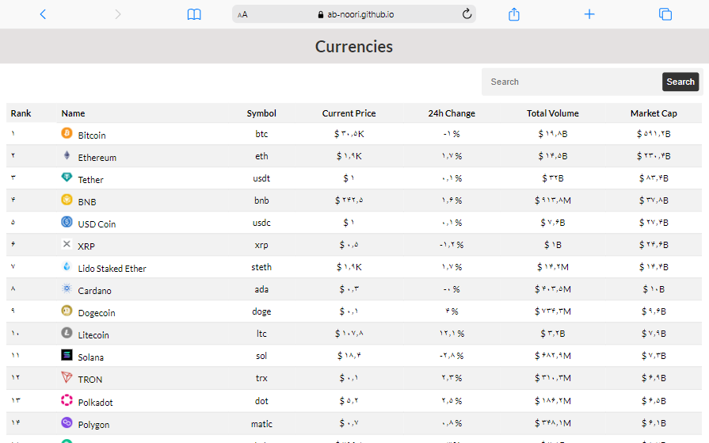
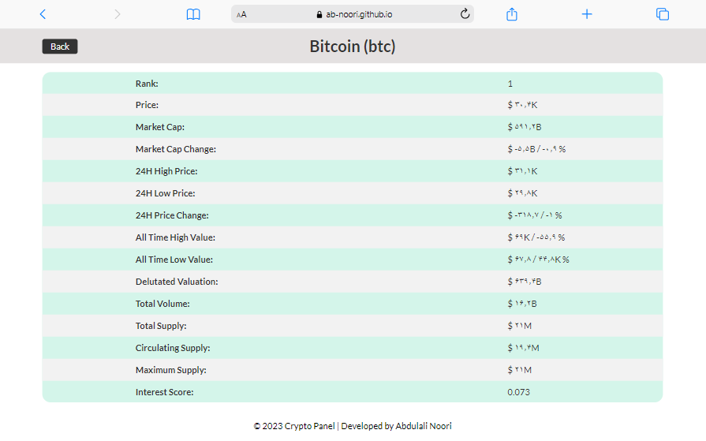
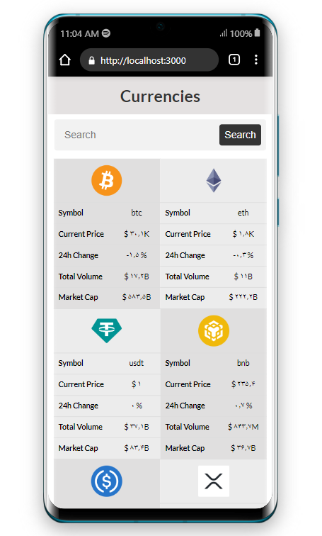
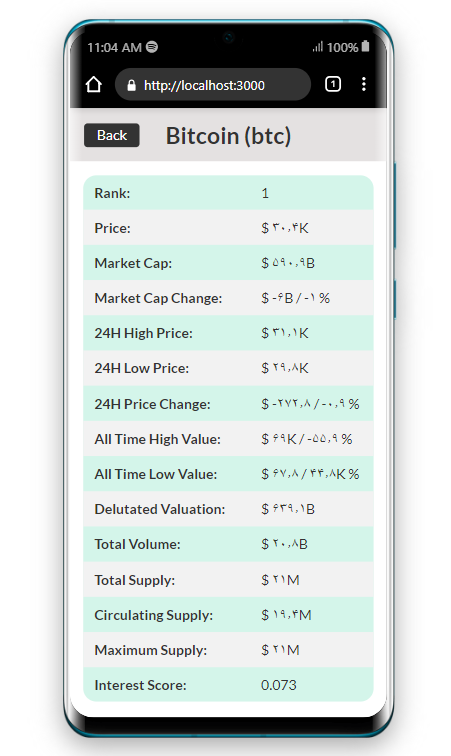

<!-- Open a pull request using the following structure

## Project Title: Branch title.............

### 🌟Features:

> - [ ] - [`i`]() ...........
> - [ ] - [`ii`]() ...................
> - [ ] - [`iii`]() ...................
> - [ ] - [`iiii`]() ...................
> - [ ] - [`iiiii`]() ...................

### [ 🚀 Project Demo](#)

-->

> # Crypto Panel

| Desktop View Representation|
|---------------------------------------|
|

|
|

|
|

 
|

<!-- TABLE OF CONTENTS -->

# 📗 Table of Contents

- [📖 About the Project](#about-project)
  - [🛠 Built With](#built-with)
    - [Tech Stack](#tech-stack)
    - [Key Features](#key-features)
  - [🚀 Live Demo](#live-demo)
- [💻 Getting Started](#getting-started)
  - [Setup](#setup)
  - [Prerequisites](#prerequisites)
  - [Install](#install)
  - [Usage](#usage)
  - [Run tests](#run-tests)
  - [Deployment](#triangular_flag_on_post-deployment)
- [👥 Authors](#authors)
- [🔭 Future Features](#future-features)
- [🤝 Contributing](#contributing)
- [⭐️ Show your support](#support)
- [🙏 Acknowledgements](#acknowledgements)
- [❓ FAQ (OPTIONAL)](#faq)
- [📝 License](#license)

<!-- PROJECT DESCRIPTION -->

# 📖 [Crypto Panel] 

> **[Cryptopanel]** is Cryptopanel is a single-page web app that is created using React and Redux and fetches data from CoinGecko API. The application allows users to get details of cryptocurrency information.

## 🛠 Built With 

### Tech Stack 
- 
Client

    <ul>
      <li><a href="https://reactjs.org/">JSX</a></li>
      <li><a href="https://reactjs.org/">SCSS</a></li>
      <li><a href="https://reactjs.org/">JavaScript</a></li>
      <li><a href="https://reactjs.org/">React-Redux</a></li>
      <li><a href="https://reactjs.org/">React-Toolkit</a></li>
      <li><a href="https://reactjs.org/">Cryptocurrency API</a></li>
    </ul>

### Key Features 

- **[Responsive layout]**
- **[UX/UI accessibility]**
- **[Dynamic data]**

(<a href="#readme-top">back to top</a>)

<!-- LIVE DEMO -->

## 🚀 Live Demo 

> - [Live Demo on Gh-pages](https://ab-noori.github.io/Cryptopanel/)

(<a href="#readme-top">back to top</a>)

<!-- GETTING STARTED -->

## 💻 Getting Started 

To get a local copy up and running, follow these steps:

### Prerequisites

In order to run this project you need:
  - A browser of your choice.
  - A text editor of your choice.
  - An installed node.js on your local system

### Setup

Clone this repository to your desired folder:

- Use the following Commands:

      cd your-desired-folder
      git clone git@github.com:ab-noori/Cryptopanel.git

### Install
- Install this project with:

       npx create-react-app .
       npm start

### Usage
- Use the following commands to run the project on your local system:

      npm run build
      npm run deploy

### Run tests
- Run the following script and style test:

      npx eslint "**/*.{js,jsx}"
      npx eslint "**/*.{js,jsx}" --fix

      npx stylelint "**/*.{css,scss}"
      npx stylelint "**/*.{css,scss}" --fix
 
### Deployment
- 1- install _gh-pages_ with following command:

      npm i gh-pages

- 2- Add _homepage_ to project's jason file:

      "homepage": "https://ab-noori.github.io/Cryptopanel",

- 3- Add the following scripts to the project's _package.jason_ file:

      "predeploy": "npm run build",
      "deploy": "gh-pages -d build ",

- 4- Finally run the following command:

      npm run deploy

(<a href="#readme-top">back to top</a>)

## 👥 Authors 

👤 **Abdul Ali Noori**

- GitHub: [@ab-noori](https://github.com/ab-noori)
- Twitter: [@AbdulAliNoori4](https://twitter.com/AbdulAliNoori4)
- LinkedIn: [abdul-ali-noori](https://www.linkedin.com/in/abdul-ali-noori-384b85195/)

## 🔭 Future Features 

- [ ] **[Giving funtionality to search input]**
- [ ] **[Using Charts and graph to disply the currencies data]**
- [ ] **[Using Creating Professional sidebar panel]**

(<a href="#readme-top">back to top</a>)

## 🤝 Contributing 

Contributions, issues, and feature requests are welcome!

Feel free to check the [issues page](https://github.com/ab-noori/Cryptopanel/issues).

(<a href="#readme-top">back to top</a>)

## ⭐️ Show your support 

 
  If you like this project, give it a star.

(<a href="#readme-top">back to top</a>)

## 🙏 Acknowledgments 

  First, I would like to thank Microverse and my coding partners. Second, I want to give credit to [`Nerd's lesson`](https://www.youtube.com/@Nerdslesson) YouTub Channel, its [`react tutorial`](https://www.youtube.com/watch?v=cd3P3yXyx30) is really helpful, and third, I should give credit to Nelson Sakwa, I got some inspirations from his design on Behance.

(<a href="#readme-top">back to top</a>)

## ❓ FAQ (OPTIONAL) 

- **How to make it mobile friendly?**

  - Put a viewport tag in the header

- **How to design the site?**

  - Draw a mockup before starting to code

(<a href="#readme-top">back to top</a>)

## 📝 License 

This project is [MIT](./LICENSE) licensed.

(<a href="#readme-top">back to top</a>)

